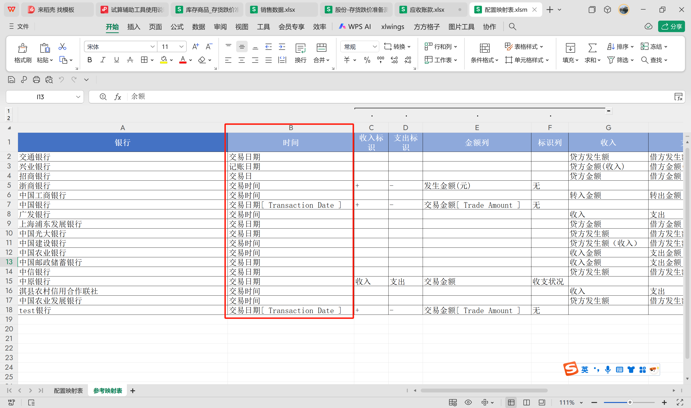
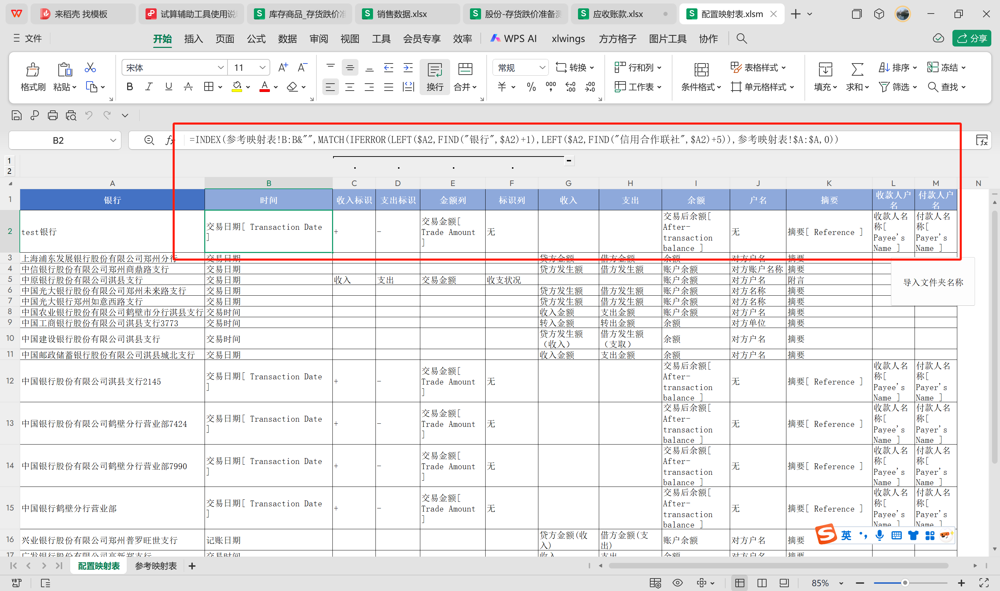
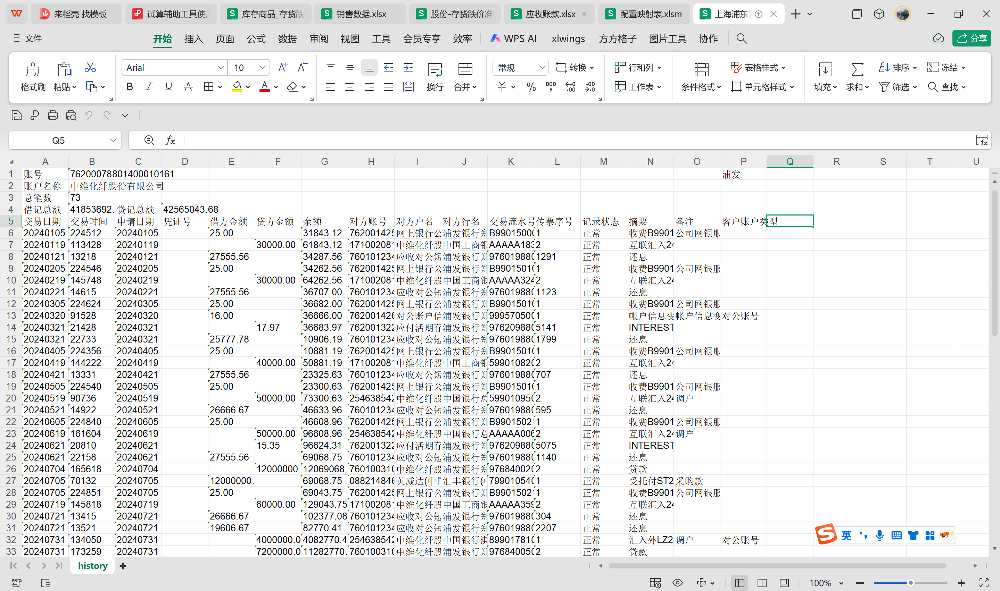
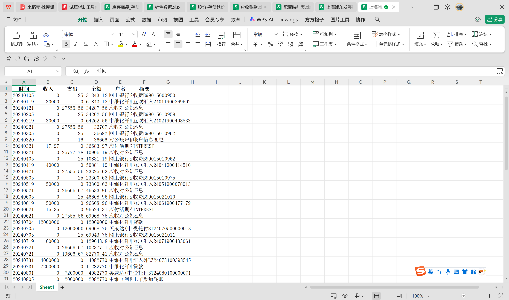

# 交接文档
此文档仅解释程序功能使用，程序具体操作指南详见文件夹/使用说明
（配置映射表有更新）

## 1.开发环境

### 1.1开发工具库：
本工具为在本地运行，使用python3.8开发
使用pandas duckdb xlwings等库进行对数据的提取处理清洗
通过streamlit 作为视觉交互的工具

## 2.功能描述

**2.1因不同银行的流水格式不同，可能某个银行某年的流水分12个月导出，手工清洗耗时耗力 故开发本工具帮助清洗银行流水生成统一格式的报表方便直接导入SACP做进一步的双向核对**

如下图示例，不同银行的[时间]字段可能不同，本工具利用统一的**映射表**将不同银行的表头和字段统一方便后续人员清洗  
**映射表目前通过excel手工配置，后续可以考虑维护到数据库中（个人认为这个工具可能还是维护好映射更方便）**

使用时现将各银行的流水数据放在各个文件夹，在<配置映射表>导入文件夹后，自动根据先前选好的公司匹配参考映射表

以浦发银行为例，清洗前原始流水如下图

清洗后，见下图

