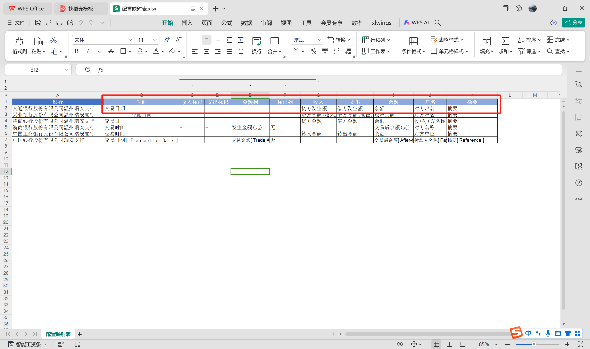

# 工具使用说明

## 写在最前
1.本工具仅支持xls/csv/xlsx文件格式，请确保文件格式正确  
2.使用本工具前需提前配置<配置映射表>,配置方法详见【温馨提示-映射表配置指南】 
3.本工具支持递归检索文件夹中的xlsx/csv/xls文件，请确保文件夹中没有压缩包，本工具暂不支持直接从压缩包提取
4.本工具使用python开发，如有兴趣学习可以查看本工具的代码仓库:  
5.本工具仅供学习交流使用，请勿用于违法犯罪，产生任何法律纠纷与本工具无关

## 第一步
1.双击打开银行流水合并清洗工具.exe

2.打开如遇到下图情况，键盘按“enter"回车建

3.等待若干秒跳出网页，点击允许，不要关闭命令行窗口

## 第二步
1.填写文件路径

2.选择<配置映射表路径>

3.选择配置文件

4.点击开始处理

5.等待处理完成

# 温馨提示
## 映射表配置指南
1.请提前准备好需要处理清洗的文件夹

2.【A列】银行处填写要处理的文件夹名称

3.【其余列】根据对应关系填入和原始数据对应的列名

4.若原始数据有单独的收入列和支出列则无需配置【收入、支出标志】

5.若原始数据没有单独的收入列和支出列，则需要配置【收入、支出标志、金额列和标识列】
6.若无【标识列】默认采用正数为收入，负数为支出

## 文件夹路径复制方法
