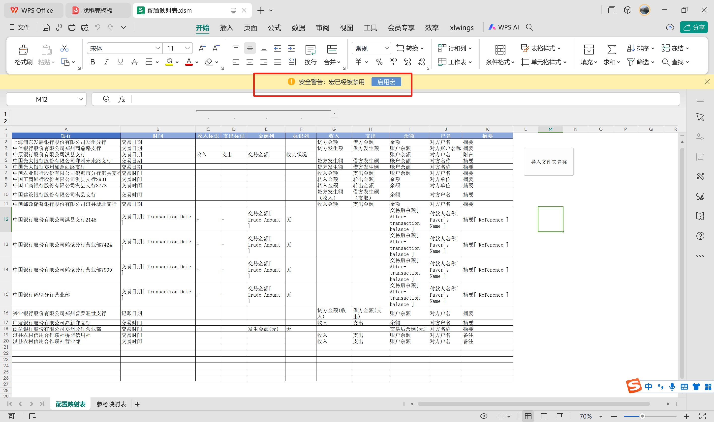
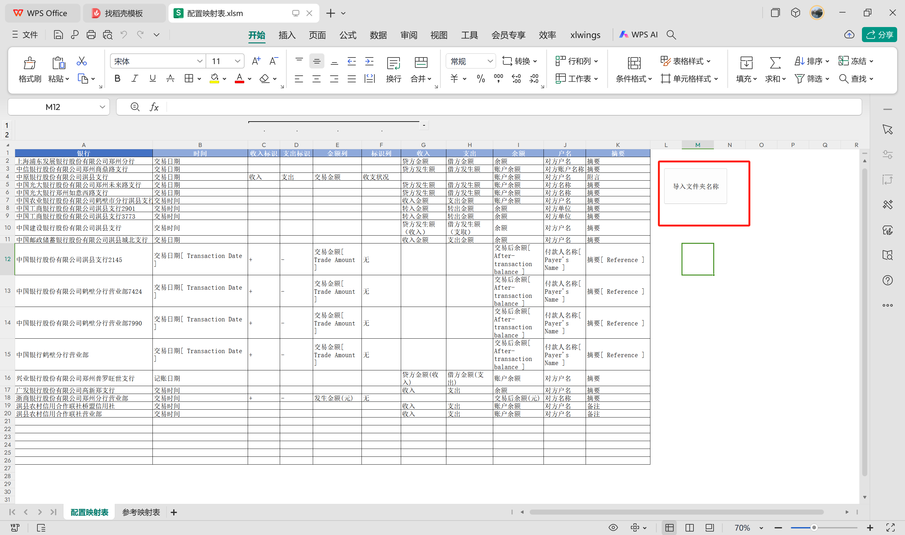
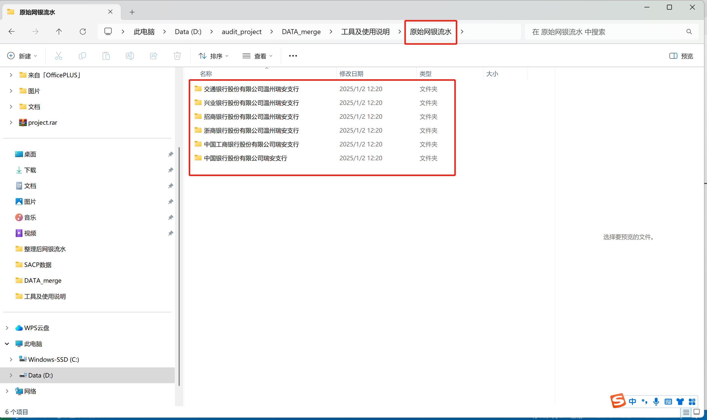
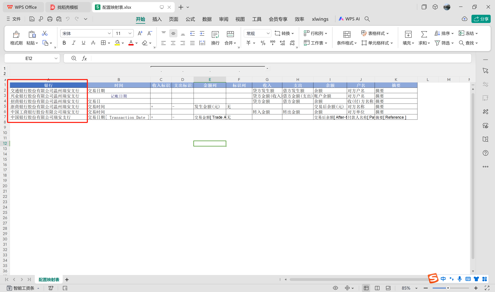
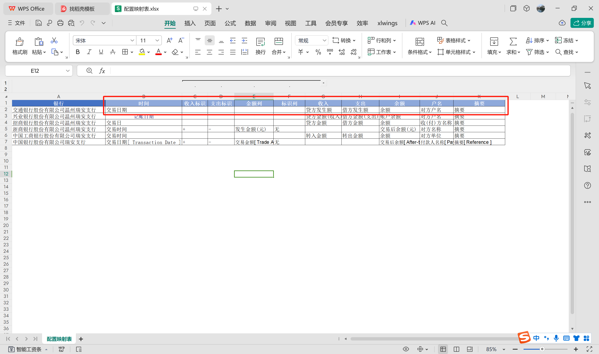
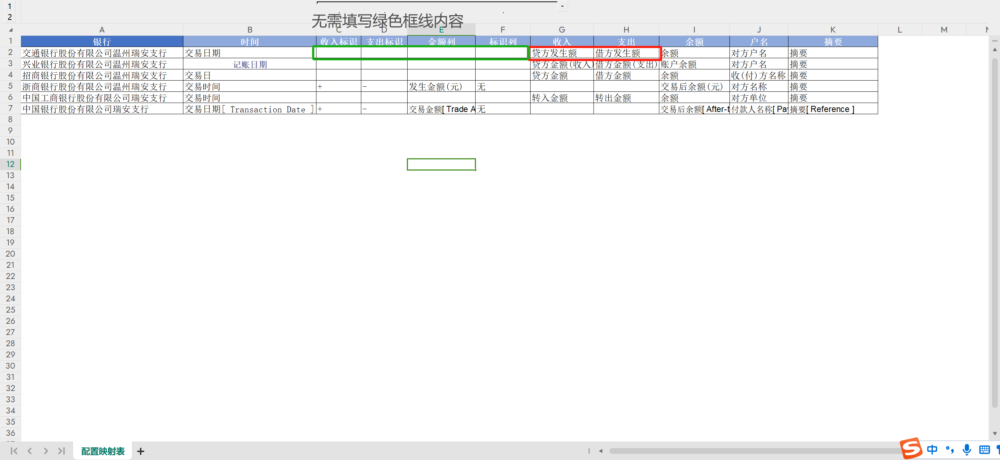
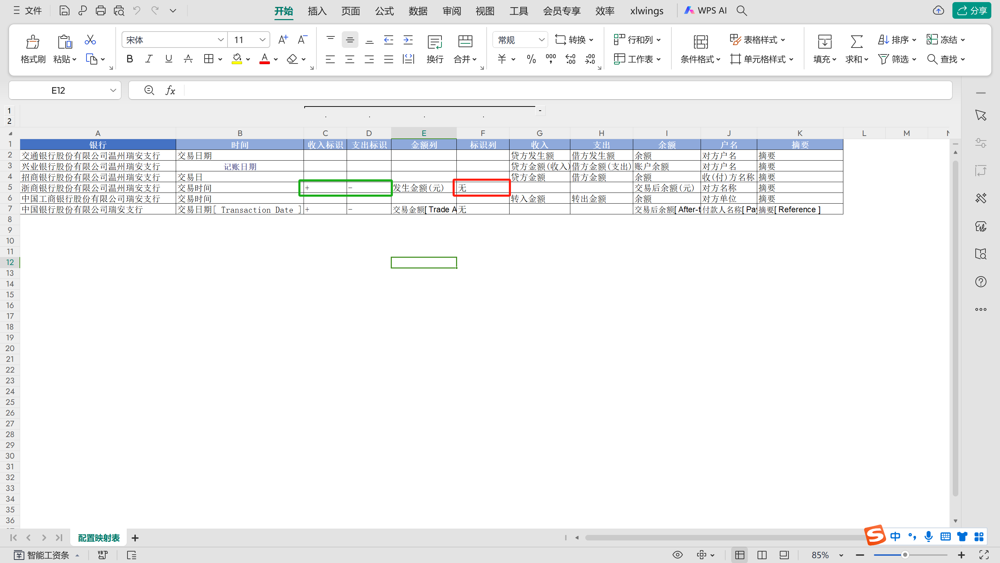

## <配置映射表.xlsm>"导入文件夹名称"按钮功能说明

功能简介：
为方便各位同事导入文件夹及其映射规则，我用VBA写了一个简单脚本，能将文件夹名称快速填入到映射表中。
  
1.使用该功能前需要启用宏

2.点击按钮“导入文件夹名称”

3.选择文件夹路径，确定后会自动填入文件夹名称到映射表中

## 映射表配置指南
1.请提前准备好需要处理清洗的文件夹

2.【A列】银行处填写要处理的文件夹名称

3.【其余列】根据对应关系填入和原始数据对应的列名

4.若原始数据有单独的收入列和支出列则无需配置【收入、支出标志】

5.若原始数据没有单独的收入列和支出列，则需要配置【收入、支出标志、金额列和标识列】
6.若无【标识列】默认采用正数为收入，负数为支出
