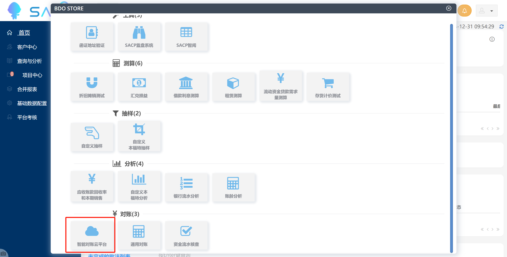
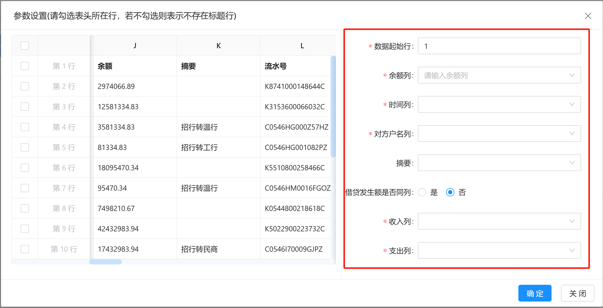
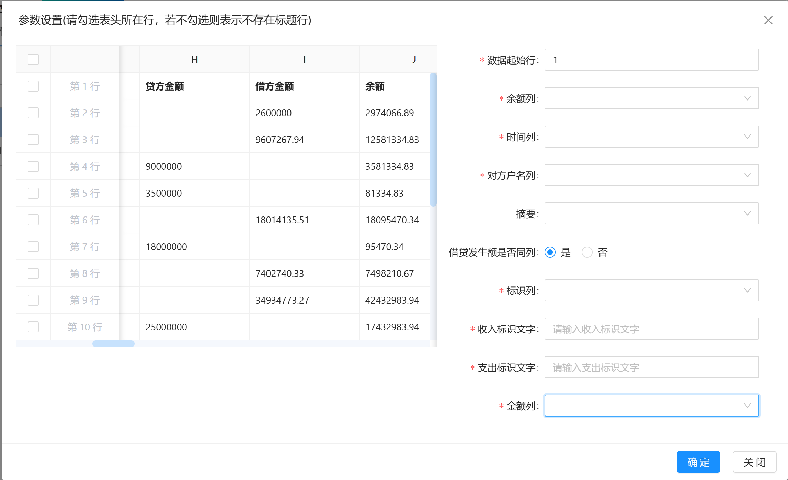

# 环境配置

conda create --name data_merge python=3.8

pip install xlwings 
pip install pandas 
pip install openpyxl 

streamlit run app.py 

# 功能设计

按映射表合并

1.遍历读取文件
2.判断表头
3.根据映射表时间判断需要的行
4.合并数据
5.分开保存

# SACP 智能对账云平台

